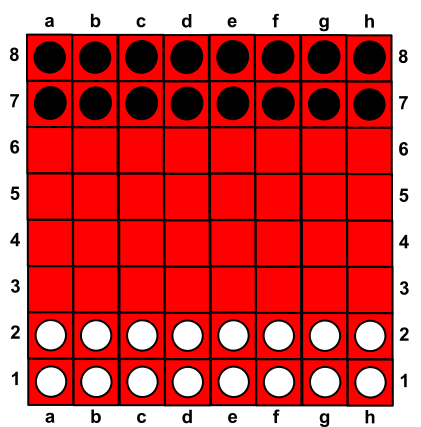
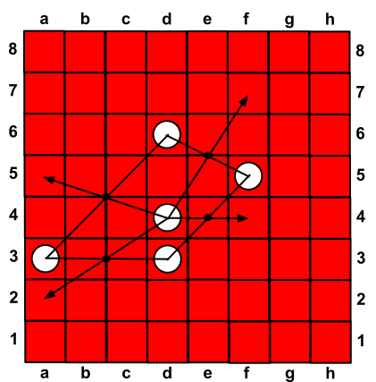
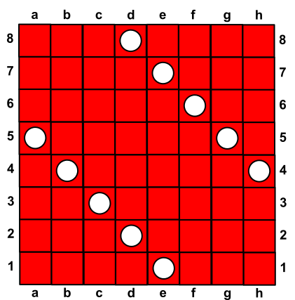

# Sanqi (三棋)

Sanqi (Çince 三棋, Sānqí, “Üç Satranç”), iki oyunculu bir strateji oyunudur ve taşlar arasındaki koordinasyon oyunda merkezi bir rol oynar.

İki oyuncu, Beyaz ve Siyah, sırayla hamle yapar. Oyuna Beyaz başlar.

Sanqi bir satranç tahtası üzerinde oynanır. Her oyuncunun on altı taşı vardır ve bu taşlar oyuncuya en yakın iki sırayı doldurur.

Bir hamle üç taş gerektirir: biri hareket eden saldıran taş, diğer ikisi ise hareket etmeyen destek taşlarıdır. Her taş hem saldıran hem de destek rolünü üstlenebilir.

İki destek taşı bir dönme noktası belirler. Bu nokta, iki taşın tam ortasında yer alır. Dönme noktası bir karenin ortasında, iki kare arasındaki kenarın ortasında ya da dört karenin kesiştiği bir köşede bulunabilir.

Saldıran taş, dönme noktası üzerinden karşı tarafa taşınır; öyle ki dönme noktası başlangıç ve hedef karelerin tam ortasında kalır (Şekil 2). Başlangıç ve hedef kare aynı olamaz, saldıran taş başlangıçta bir dönme noktasının üzerinde bulunsa bile.

Saldıran taşın kat edebileceği mesafe için bir sınır yoktur; tek şart, hamlenin tahtanın içinde kalmasıdır. Hareket yönü tahtanın kenarlarına veya çaprazlarına paralel olmak zorunda değildir; birçok farklı yön mümkündür.

Hedef kare ya boş olmalı ya da rakip bir taş tarafından işgal edilmiş olmalıdır; bu durumda rakip taş alınır ve oyundan çıkarılır.

Yasal hamle yapamayan oyuncu oyunu kaybeder. Bu durum, örneğin bir oyuncunun üçten az taşı kaldığında ortaya çıkabilir. Ayrıca bir oyuncu, taşlarının birbirini engellemesi nedeniyle hiçbir hamle yapamaz hale gelirse de kaybeder.

